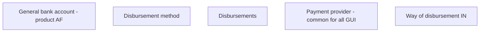

# Way of disbursement IN

```mermaid
graph TD
    General_bank_account_product_AF["General bank account - product AF"]
    Disbursement_method["Disbursement method"]
    Disbursements["Disbursements"]
    Payment_provider_common_for_all_GUI["Payment provider - common for all GUI"]
    Way_of_disbursement_IN["Way of disbursement IN"]
```
