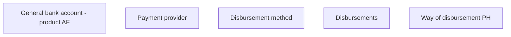

# Way of disbursement PH

- **Diagram Type**: Custom
- **Package**: HomerSelect/BSL/Analysis Model/Contract Origination/Fill in application/COMMON for Fill in application/User Interface Model/PH/Payment information PH/Way of disbursement PH
- **Diagram ID**: 107734
- **Elements**: 5
- **Connectors**: 0

