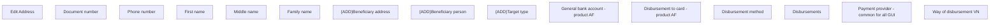

# Way of disbursement VN

```mermaid
graph TD
    Edit_Address["Edit Address"]
    Document_number["Document number"]
    Phone_number["Phone number"]
    First_name["First name"]
    Middle_name["Middle name"]
    Family_name["Family name"]
    ADD_Beneficiary_address["{ADD}Beneficiary address"]
    ADD_Beneficiary_person["{ADD}Beneficiary person"]
    ADD_Target_type["{ADD}Target type"]
    General_bank_account_product_AF["General bank account - product AF"]
    Disbursement_to_card_product_AF["Disbursement to card - product AF"]
    Disbursement_method["Disbursement method"]
    Disbursements["Disbursements"]
    Payment_provider_common_for_all_GUI["Payment provider - common for all GUI"]
    Way_of_disbursement_VN["Way of disbursement VN"]
```
