# Way of repayment - product AF

- **Diagram Type**: Custom
- **Package**: HomerSelect/BSL/Analysis Model/Contract Origination/Fill in application/COMMON for Fill in application/User Interface Model/Product/Payment information - product AF/Way of repayment - product AF
- **Diagram ID**: 158357
- **Elements**: 13
- **Connectors**: 0

```mermaid
graph TD
    ADD_Existing_DDM["{ADD}Existing DDM"]
    Source["Source"]
    DDM_type["DDM type"]
    Frequency["Frequency"]
    Regular_payment_amount["Regular payment amount"]
    Regular_payment["Regular payment"]
    MOD_Repayment_method["{MOD}Repayment method"]
    Payment_method["Payment method"]
    Use_DDM_account_for_credit_disbursement["Use DDM account for credit disbursement"]
    MOD_DDM_bank_account["{MOD}DDM bank account"]
    Limit["Limit"]
    Direct_debit_mandate["Direct debit mandate"]
    Way_of_repayment_product_AF["Way of repayment - product AF"]
```

