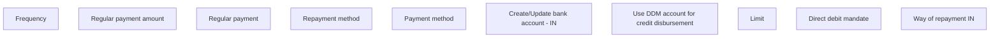

# Way of repayment IN

```mermaid
graph TD
    Frequency["Frequency"]
    Regular_payment_amount["Regular payment amount"]
    Regular_payment["Regular payment"]
    Repayment_method["Repayment method"]
    Payment_method["Payment method"]
    Create_Update_bank_account_IN["Create/Update bank account - IN"]
    Use_DDM_account_for_credit_disbursement["Use DDM account for credit disbursement"]
    Limit["Limit"]
    Direct_debit_mandate["Direct debit mandate"]
    Way_of_repayment_IN["Way of repayment IN"]
```
