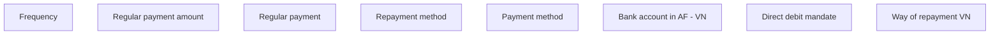

# Way of repayment VN

```mermaid
graph TD
    Frequency["Frequency"]
    Regular_payment_amount["Regular payment amount"]
    Regular_payment["Regular payment"]
    Repayment_method[" Repayment method"]
    Payment_method["Payment method"]
    Bank_account_in_AF_VN["Bank account in AF - VN"]
    Direct_debit_mandate["Direct debit mandate"]
    Way_of_repayment_VN["Way of repayment VN"]
```
