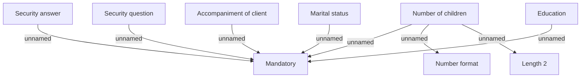

# Additional data

```mermaid
graph TD
    Security_answer["Security answer"]
    Security_question["Security question"]
    Length_2["Length 2"]
    Number_of_children["Number of children"]
    Accompaniment_of_client["Accompaniment of client"]
    Marital_status["Marital status"]
    Education["Education"]
    Number_format["Number format"]
    Mandatory["Mandatory"]
    Security_answer -->|unnamed| Mandatory
    Security_question -->|unnamed| Mandatory
    Number_of_children -->|unnamed| Mandatory
    Accompaniment_of_client -->|unnamed| Mandatory
    Marital_status -->|unnamed| Mandatory
    Education -->|unnamed| Mandatory
    Number_of_children -->|unnamed| Number_format
    Number_of_children -->|unnamed| Length_2
```
