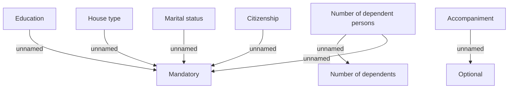

# Additional personal data

- **Diagram Type**: Custom
- **Package**: HomerSelect/BSL/Analysis Model/Contract Origination/Fill in application/COMMON for Fill in application/Validation Rules/PH/Personal information/Additional personal data
- **Diagram ID**: 149327
- **Elements**: 9
- **Connectors**: 7

