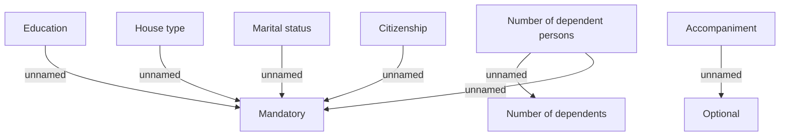

# Additional personal data

```mermaid
graph TD
    Citizenship["Citizenship"]
    Optional["Optional"]
    Accompaniment["Accompaniment"]
    Number_of_dependents["Number of dependents"]
    Mandatory["Mandatory"]
    Number_of_dependent_persons["Number of dependent persons"]
    Marital_status["Marital status"]
    House_type["House type"]
    Education["Education"]
    Education -->|unnamed| Mandatory
    House_type -->|unnamed| Mandatory
    Marital_status -->|unnamed| Mandatory
    Number_of_dependent_persons -->|unnamed| Number_of_dependents
    Number_of_dependent_persons -->|unnamed| Mandatory
    Accompaniment -->|unnamed| Optional
    Citizenship -->|unnamed| Mandatory
```
