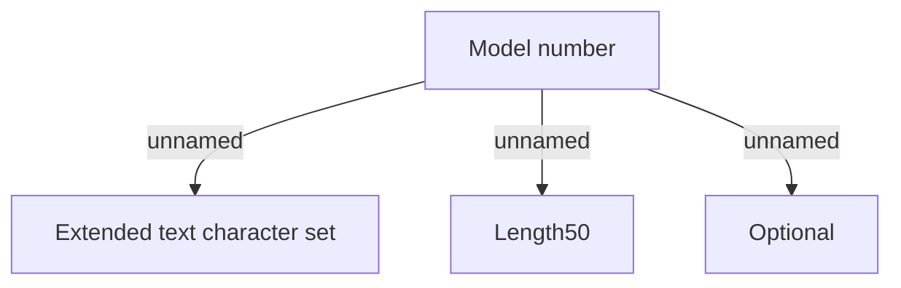

# Commodities validation

- **Diagram Type**: Custom
- **Package**: HomerSelect/BSL/Analysis Model/Contract Origination/Fill in application/COMMON for Fill in application/Validation Rules/ID/Commodities validation
- **Diagram ID**: 126639
- **Elements**: 4
- **Connectors**: 3

