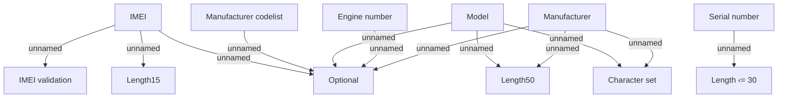

# Commodities validation

- **Diagram Type**: Custom
- **Package**: HomerSelect/BSL/Analysis Model/Contract Origination/Fill in application/COMMON for Fill in application/Validation Rules/IN/Commodities validation
- **Diagram ID**: 85031
- **Elements**: 12
- **Connectors**: 12

