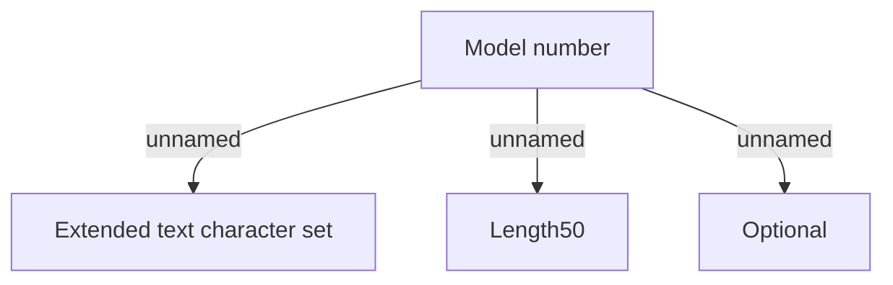

# Commodities validation

```mermaid
graph TD
    Optional["Optional"]
    Length50["Length50"]
    Extended_text_character_set["Extended text character set"]
    Model_number["Model number"]
    Model_number -->|unnamed| Extended_text_character_set
    Model_number -->|unnamed| Length50
    Model_number -->|unnamed| Optional
```
