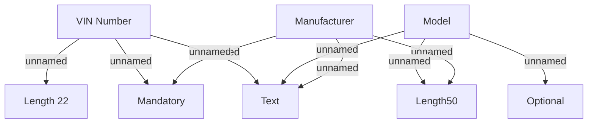

# Commodity

- **Diagram Type**: Custom
- **Package**: HomerSelect/BSL/Analysis Model/Contract Origination/Fill in application/COMMON for Fill in application/Validation Rules/VN/Commodities/Commodity
- **Diagram ID**: 101802
- **Elements**: 8
- **Connectors**: 9

