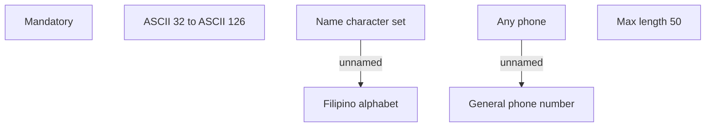

# Common for AF

- **Diagram Type**: Custom
- **Package**: HomerSelect/BSL/Analysis Model/Contract Origination/Fill in application/COMMON for Fill in application/Validation Rules/PH/Common for AF
- **Diagram ID**: 122203
- **Elements**: 7
- **Connectors**: 2

