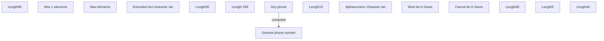

# Common

- **Diagram Type**: Custom
- **Package**: HomerSelect/BSL/Analysis Model/Contract Origination/Fill in application/COMMON for Fill in application/Validation Rules/ID/Common for AF
- **Diagram ID**: 123553
- **Elements**: 15
- **Connectors**: 1

