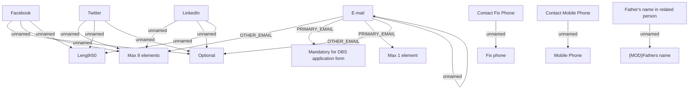

# Contact data

- **Diagram Type**: Custom
- **Package**: HomerSelect/BSL/Analysis Model/Contract Origination/Fill in application/COMMON for Fill in application/Validation Rules/IN/Contact data
- **Diagram ID**: 139558
- **Elements**: 16
- **Connectors**: 17

