# Contact information

- **Diagram Type**: Custom
- **Package**: HomerSelect/BSL/Analysis Model/Contract Origination/Fill in application/COMMON for Fill in application/Validation Rules/PH/Contact information
- **Diagram ID**: 111690
- **Elements**: 22
- **Connectors**: 24

```mermaid
graph TD
    Length_30["Length ‹= 30"]
    Date_in_past["Date in past"]
    Remitter_s_phone_format["Remitter's phone format"]
    Length_8_20["Length 8-20"]
    Remitter_s_phone["Remitter's phone"]
    Financial_amount_0["Financial amount ›= 0"]
    Received_from["Received from"]
    Proof["Proof"]
    Periodicity["Periodicity"]
    Country["Country"]
    Channel["Channel"]
    Amount["Amount"]
    Occupation["Occupation"]
    General_phone_number["General phone number"]
    Filipino_alphabet["Filipino alphabet"]
    Name_character_set["Name character set"]
    Optional["Optional"]
    Mandatory["Mandatory"]
    Phone["Phone"]
    Middle_name["Middle name"]
    Last_name["Last name"]
    First_name["First name"]
    Middle_name -->|unnamed| Optional
    Middle_name -->|unnamed| Length_30
    Last_name -->|unnamed| Length_30
    Received_from -->|unnamed| Date_in_past
    Remitter_s_phone -->|unnamed| Remitter_s_phone_format
    Remitter_s_phone -->|unnamed| Length_8_20
    Amount -->|unnamed| Financial_amount_0
    Phone -->|unnamed| General_phone_number
    First_name -->|unnamed| Name_character_set
    First_name -->|unnamed| Length_30
    Middle_name -->|unnamed| Name_character_set
    Amount -->|unnamed| Mandatory
    Received_from -->|unnamed| Mandatory
    Proof -->|unnamed| Mandatory
    Periodicity -->|unnamed| Mandatory
    Country -->|unnamed| Mandatory
    Channel -->|unnamed| Mandatory
    Remitter_s_phone -->|unnamed| Mandatory
    Occupation -->|unnamed| Mandatory
    Phone -->|unnamed| Mandatory
    Last_name -->|unnamed| Mandatory
    First_name -->|unnamed| Mandatory
    Last_name -->|unnamed| Name_character_set
    Name_character_set -->|unnamed| Filipino_alphabet
```

