# Contact information

- **Diagram Type**: Custom
- **Package**: HomerSelect/BSL/Analysis Model/Contract Origination/Fill in application/COMMON for Fill in application/Validation Rules/VN/Contact information
- **Diagram ID**: 122868
- **Elements**: 12
- **Connectors**: 18

```mermaid
graph TD
    Latin_extended_characters["Latin extended characters"]
    Alphabetical_string["Alphabetical string"]
    Length_30["Length ‹= 30"]
    VN_chars["VN chars"]
    Length_90["Length 90"]
    Length8_11_digits["Length8-11 digits"]
    Number_format["Number format"]
    Mandatory["Mandatory"]
    Phone_number["Phone number"]
    Family_name["Family name"]
    Middle_name["Middle name"]
    First_name["First name"]
    Middle_name -->|unnamed| VN_chars
    Phone_number -->|unnamed| Mandatory
    Phone_number -->|unnamed| Length8_11_digits
    Family_name -->|unnamed| Latin_extended_characters
    Family_name -->|unnamed| VN_chars
    Family_name -->|unnamed| Mandatory
    Family_name -->|unnamed| Alphabetical_string
    Phone_number -->|unnamed| Number_format
    Middle_name -->|unnamed| Length_30
    First_name -->|unnamed| Mandatory
    Middle_name -->|unnamed| Mandatory
    Middle_name -->|unnamed| Latin_extended_characters
    Middle_name -->|unnamed| Alphabetical_string
    First_name -->|unnamed| Latin_extended_characters
    First_name -->|unnamed| Alphabetical_string
    First_name -->|unnamed| VN_chars
    First_name -->|unnamed| Length_90
    Family_name -->|unnamed| Length_30
```

