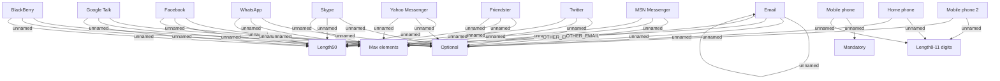

# Contact to client

```mermaid
graph TD
    Email["Email"]
    Length50["Length50"]
    Yahoo_Messenger["Yahoo Messenger"]
    WhatsApp["WhatsApp"]
    Twitter["Twitter"]
    Skype["Skype"]
    MSN_Messenger["MSN Messenger"]
    Friendster["Friendster"]
    Facebook["Facebook"]
    BlackBerry["BlackBerry"]
    Google_Talk["Google Talk"]
    Max_elements["Max elements"]
    Mandatory["Mandatory"]
    Optional["Optional"]
    Length8_11_digits["Length8-11 digits"]
    Email["Email"]
    Home_phone["Home phone"]
    Mobile_phone_2["Mobile phone 2"]
    Mobile_phone["Mobile phone"]
    Twitter -->|unnamed| Optional
    Friendster -->|unnamed| Max_elements
    Friendster -->|unnamed| Length50
    MSN_Messenger -->|unnamed| Optional
    MSN_Messenger -->|unnamed| Max_elements
    MSN_Messenger -->|unnamed| Length50
    Skype -->|unnamed| Optional
    Yahoo_Messenger -->|unnamed| Length50
    Skype -->|unnamed| Length50
    Facebook -->|unnamed| Max_elements
    Twitter -->|unnamed| Max_elements
    Twitter -->|unnamed| Length50
    WhatsApp -->|unnamed| Optional
    WhatsApp -->|unnamed| Max_elements
    WhatsApp -->|unnamed| Length50
    Yahoo_Messenger -->|unnamed| Optional
    Yahoo_Messenger -->|unnamed| Max_elements
    Skype -->|unnamed| Max_elements
    Google_Talk -->|unnamed| Optional
    Mobile_phone -->|unnamed| Mandatory
    Mobile_phone_2 -->|unnamed| Length8_11_digits
    Mobile_phone_2 -->|unnamed| Optional
    Home_phone -->|unnamed| Length8_11_digits
    Home_phone -->|unnamed| Optional
    Email -->|unnamed| Email
    Email -->|unnamed| Optional
    Friendster -->|unnamed| Optional
    Email -->|OTHER_EMAIL| Length50
    Facebook -->|unnamed| Length50
    Google_Talk -->|unnamed| Max_elements
    Google_Talk -->|unnamed| Length50
    BlackBerry -->|unnamed| Optional
    BlackBerry -->|unnamed| Max_elements
    BlackBerry -->|unnamed| Length50
    Facebook -->|unnamed| Optional
    Mobile_phone -->|unnamed| Length8_11_digits
    Email -->|OTHER_EMAIL| Max_elements
```
