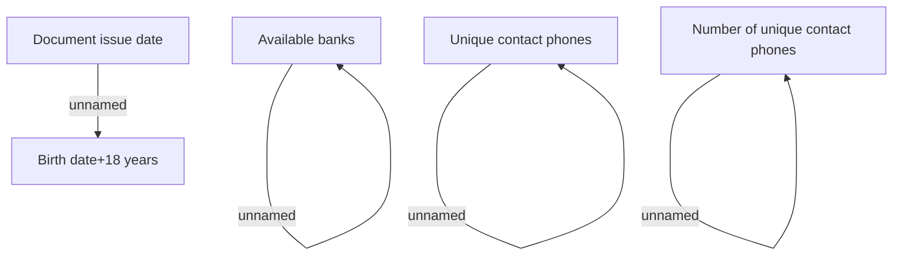

# Cross validation

```mermaid
graph TD
    Birth_date_18_years["Birth date+18 years"]
    Document_issue_date["Document issue date"]
    Available_banks["Available banks"]
    Available_banks["Available banks"]
    Unique_contact_phones["Unique contact phones "]
    Unique_contact_phones["Unique contact phones"]
    Number_of_unique_contact_phones["Number of unique contact phones "]
    Number_of_unique_contact_phones["Number of unique contact phones "]
    Number_of_unique_contact_phones -->|unnamed| Number_of_unique_contact_phones
    Unique_contact_phones -->|unnamed| Unique_contact_phones
    Available_banks -->|unnamed| Available_banks
    Document_issue_date -->|unnamed| Birth_date_18_years
```
