# Cross validations

- **Diagram Type**: Custom
- **Package**: HomerSelect/BSL/Analysis Model/Contract Origination/Fill in application/COMMON for Fill in application/Validation Rules/IN/Cross validations
- **Diagram ID**: 153778
- **Elements**: 17
- **Connectors**: 10

```mermaid
graph TD
    Obligation_of_spouse_related_person["Obligation of spouse related person"]
    Obligation_of_related_person_for_married["Obligation of related person for married"]
    Obligation_of_related_person_for_student["Obligation of related person for student"]
    Obligation_of_student_ID["Obligation of student ID"]
    Living_in_hostel["Living in hostel"]
    Obligation_of_student_ID["Obligation of student ID"]
    Living_as_Paying_guest["Living as 'Paying guest'"]
    Obligation_of_family_member["Obligation of family member"]
    Unique_phones["Unique phones "]
    Unique_phones["Unique phones"]
    Obligation_of_contact_person_s_phones["Obligation of contact person's phones"]
    Obligation_of_contact_person_s_phones["Obligation of contact person's phones"]
    Unique_contact_person_phones["Unique contact person phones "]
    Number_of_unique_contact_phones["Number of unique contact phones "]
    Unique_contact_person_phones["Unique contact person phones "]
    Number_of_unique_contact_phones["Number of unique contact phones "]
    Living_in_rented_house_type["Living in rented house type"]
    Number_of_unique_contact_phones -->|unnamed| Number_of_unique_contact_phones
    Unique_contact_person_phones -->|unnamed| Unique_contact_person_phones
    Obligation_of_contact_person_s_phones -->|unnamed| Obligation_of_contact_person_s_phones
    Unique_phones -->|unnamed| Unique_phones
    Obligation_of_student_ID -->|unnamed| Obligation_of_student_ID
    Obligation_of_related_person_for_student -->|unnamed| Living_as_Paying_guest
    Obligation_of_related_person_for_student -->|unnamed| Living_in_hostel
    Obligation_of_related_person_for_student -->|unnamed| Obligation_of_family_member
    Obligation_of_related_person_for_student -->|unnamed| Living_in_rented_house_type
    Obligation_of_related_person_for_married -->|unnamed| Obligation_of_spouse_related_person
```

