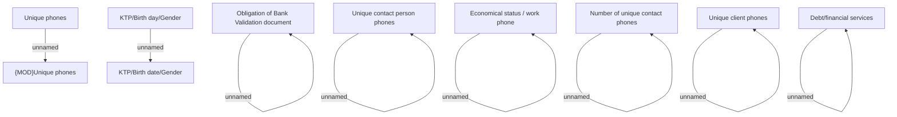

# Cross validations

```mermaid
graph TD
    Obligation_of_Bank_Validation_document["Obligation of Bank Validation document"]
    Obligation_of_Bank_Validation_document["Obligation of Bank Validation document"]
    Unique_contact_person_phones["Unique contact person phones "]
    Economical_status_work_phone["Economical status / work phone"]
    Economical_status_work_phone["Economical status / work phone"]
    MOD_Unique_phones["{MOD}Unique phones "]
    Unique_phones["Unique phones"]
    Number_of_unique_contact_phones["Number of unique contact phones "]
    Number_of_unique_contact_phones["Number of unique contact phones "]
    Unique_contact_person_phones["Unique contact person phones "]
    Unique_client_phones["Unique client phones"]
    Unique_client_phones["Unique client phones "]
    Debt_financial_services["Debt/financial services"]
    Debt_financial_services["Debt/financial services"]
    KTP_Birth_date_Gender["KTP/Birth date/Gender"]
    KTP_Birth_day_Gender["KTP/Birth day/Gender"]
    KTP_Birth_day_Gender -->|unnamed| KTP_Birth_date_Gender
    Debt_financial_services -->|unnamed| Debt_financial_services
    Unique_client_phones -->|unnamed| Unique_client_phones
    Unique_contact_person_phones -->|unnamed| Unique_contact_person_phones
    Number_of_unique_contact_phones -->|unnamed| Number_of_unique_contact_phones
    Unique_phones -->|unnamed| MOD_Unique_phones
    Economical_status_work_phone -->|unnamed| Economical_status_work_phone
    Obligation_of_Bank_Validation_document -->|unnamed| Obligation_of_Bank_Validation_document
```
