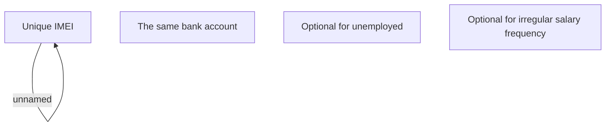

# Cross-validation

- **Diagram Type**: Custom
- **Package**: HomerSelect/BSL/Analysis Model/Contract Origination/Fill in application/COMMON for Fill in application/Validation Rules/VN/Common for AF/Cross-validation
- **Diagram ID**: 123542
- **Elements**: 5
- **Connectors**: 1

