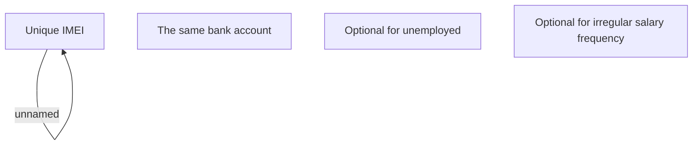

# Cross-validation

```mermaid
graph TD
    Unique_IMEI["Unique IMEI"]
    Unique_IMEI["Unique IMEI"]
    The_same_bank_account["The same bank account"]
    Optional_for_unemployed["Optional for unemployed "]
    Optional_for_irregular_salary_frequency["Optional for irregular salary frequency"]
    Unique_IMEI -->|unnamed| Unique_IMEI
```
