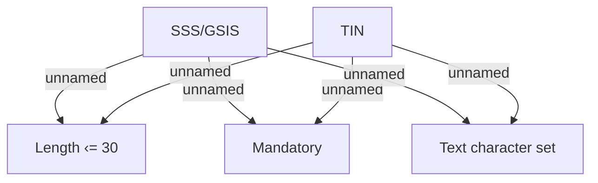

# Documents

- **Diagram Type**: Custom
- **Package**: HomerSelect/BSL/Analysis Model/Contract Origination/Fill in application/COMMON for Fill in application/Validation Rules/PH/Documents
- **Diagram ID**: 85041
- **Elements**: 5
- **Connectors**: 6

