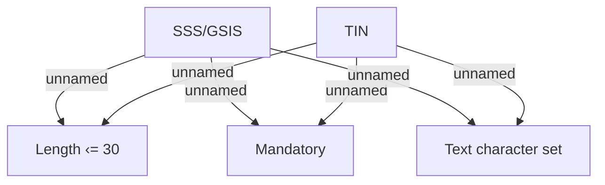

# Documents

```mermaid
graph TD
    Length_30["Length ‹= 30"]
    Text_character_set["Text character set"]
    Mandatory["Mandatory"]
    SSS_GSIS["SSS/GSIS"]
    TIN["TIN"]
    SSS_GSIS -->|unnamed| Length_30
    TIN -->|unnamed| Length_30
    SSS_GSIS -->|unnamed| Mandatory
    TIN -->|unnamed| Mandatory
    SSS_GSIS -->|unnamed| Text_character_set
    TIN -->|unnamed| Text_character_set
```
