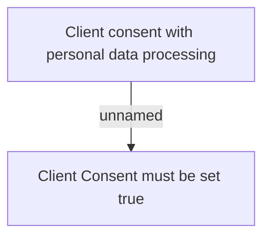

# Documents

```mermaid
graph TD
    Client_Consent_must_be_set_true["Client Consent must be set true"]
    Client_consent_with_personal_data_processing["Client consent with personal data processing"]
    Client_consent_with_personal_data_processing -->|unnamed| Client_Consent_must_be_set_true
```
