# Employer

- **Diagram Type**: Custom
- **Package**: HomerSelect/BSL/Analysis Model/Contract Origination/Fill in application/COMMON for Fill in application/Validation Rules/VN/Employment/Employer
- **Diagram ID**: 83365
- **Elements**: 15
- **Connectors**: 18

```mermaid
graph TD
    Length60["Length60"]
    Street["Street"]
    Length_40["Length 40"]
    Length_20["Length 20"]
    District["District"]
    Province["Province"]
    Ward["Ward"]
    House_Number["House Number"]
    Optional_for_unemployed["Optional for unemployed "]
    Date_in_past["Date in past"]
    Date_MM_YY["Date MM/YY"]
    Employed_since["Employed since"]
    Profession["Profession"]
    Company_name["Company name"]
    Text["Text"]
    District -->|unnamed| Optional_for_unemployed
    Ward -->|unnamed| Length_40
    Street -->|unnamed| Length_40
    House_Number -->|unnamed| Length_20
    House_Number -->|unnamed| Optional_for_unemployed
    Street -->|unnamed| Optional_for_unemployed
    Profession -->|unnamed| Optional_for_unemployed
    Company_name -->|unnamed| Length60
    Company_name -->|unnamed| Optional_for_unemployed
    Company_name -->|unnamed| Text
    Ward -->|unnamed| Optional_for_unemployed
    Province -->|unnamed| Optional_for_unemployed
    Employed_since -->|unnamed| Date_in_past
    Employed_since -->|unnamed| Date_MM_YY
    Street -->|unnamed| Text
    Ward -->|unnamed| Text
    House_Number -->|unnamed| Text
    Employed_since -->|unnamed| Optional_for_unemployed
```

