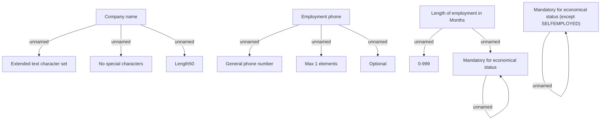

# Employment data validation

```mermaid
graph TD
    Mandatory_for_economical_status_except_SELFEMPLOYED["Mandatory for economical status (except SELFEMPLOYED)"]
    Mandatory_for_economical_status_except_SELFEMPLOYED["Mandatory for economical status (except SELFEMPLOYED)"]
    Length50["Length50"]
    No_special_characters["No special characters"]
    Max_1_elements["Max 1 elements"]
    Optional["Optional"]
    n_0_999["0-999"]
    Length_of_employment_in_Months["Length of employment in Months"]
    General_phone_number["General phone number"]
    Employment_phone["Employment phone"]
    Mandatory_for_economical_status["Mandatory for economical status"]
    Mandatory_for_economical_status["Mandatory for economical status"]
    Extended_text_character_set["Extended text character set"]
    Company_name["Company name"]
    Company_name -->|unnamed| Extended_text_character_set
    Company_name -->|unnamed| No_special_characters
    Company_name -->|unnamed| Length50
    Mandatory_for_economical_status -->|unnamed| Mandatory_for_economical_status
    Employment_phone -->|unnamed| General_phone_number
    Employment_phone -->|unnamed| Max_1_elements
    Employment_phone -->|unnamed| Optional
    Length_of_employment_in_Months -->|unnamed| n_0_999
    Length_of_employment_in_Months -->|unnamed| Mandatory_for_economical_status
    Mandatory_for_economical_status_except_SELFEMPLOYED -->|unnamed| Mandatory_for_economical_status_except_SELFEMPLOYED
```
