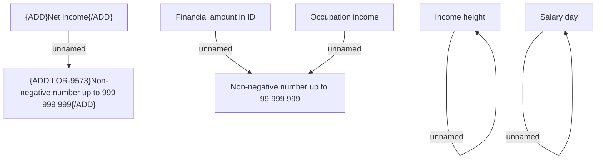

# Financial data validation

```mermaid
graph TD
    ADD_Net_income_ADD["{ADD}Net income{/ADD}"]
    ADD_LOR_9573_Non_negative_number_up_to_999_999_999_ADD["{ADD LOR-9573}Non-negative number up to 999 999 999{/ADD}"]
    Non_negative_number_up_to_99_999_999["Non-negative number up to 99 999 999  "]
    Income_height["Income height"]
    Income_height["Income height"]
    Financial_amount_in_ID["Financial amount in ID"]
    Occupation_income["Occupation income"]
    Salary_day["Salary day"]
    Salary_day["Salary day"]
    ADD_Net_income_ADD -->|unnamed| ADD_LOR_9573_Non_negative_number_up_to_999_999_999_ADD
    Salary_day -->|unnamed| Salary_day
    Income_height -->|unnamed| Income_height
    Financial_amount_in_ID -->|unnamed| Non_negative_number_up_to_99_999_999
    Occupation_income -->|unnamed| Non_negative_number_up_to_99_999_999
```
