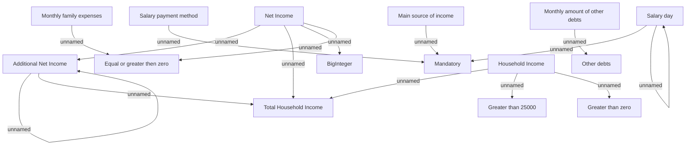

# Financial data

- **Diagram Type**: Custom
- **Package**: HomerSelect/BSL/Analysis Model/Contract Origination/Fill in application/COMMON for Fill in application/Validation Rules/IN/Financial data
- **Diagram ID**: 153714
- **Elements**: 17
- **Connectors**: 15

