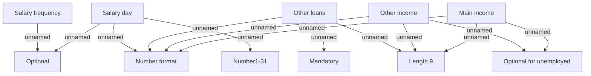

# Income

- **Diagram Type**: Custom
- **Package**: HomerSelect/BSL/Analysis Model/Contract Origination/Fill in application/COMMON for Fill in application/Validation Rules/VN/Employment/Income
- **Diagram ID**: 43748
- **Elements**: 11
- **Connectors**: 13

