# Other information

- **Diagram Type**: Custom
- **Package**: HomerSelect/BSL/Analysis Model/Contract Origination/Fill in application/COMMON for Fill in application/Validation Rules/PH/Other information
- **Diagram ID**: 158509
- **Elements**: 15
- **Connectors**: 15

```mermaid
graph TD
    Length_50["Length ‹= 50"]
    Reason_for_using_HoSel_code["Reason for using HoSel - code"]
    Reason_for_using_HoSel_description["Reason for using HoSel - description"]
    Lead_ID["Lead ID"]
    Length_30["Length ‹= 30"]
    Alphanumeric_character_set["Alphanumeric character set"]
    Additional_information["Additional information"]
    Lead_ID_Offer_ID_PIN["Lead ID/Offer ID/PIN"]
    Filipino_alphabet["Filipino alphabet"]
    ASCII_32_to_ASCII_126["ASCII 32 to ASCII 126"]
    Length_255["Length 255"]
    Mandatory["Mandatory"]
    Optional["Optional"]
    Internal_code["Internal code"]
    Comments["Comments"]
    Comments -->|unnamed| Length_255
    Comments -->|unnamed| Optional
    Comments -->|unnamed| Filipino_alphabet
    Comments -->|unnamed| ASCII_32_to_ASCII_126
    Internal_code -->|unnamed| Mandatory
    Lead_ID_Offer_ID_PIN -->|unnamed| Length_30
    Lead_ID_Offer_ID_PIN -->|unnamed| Optional
    Lead_ID_Offer_ID_PIN -->|unnamed| Alphanumeric_character_set
    Additional_information -->|unnamed| Optional
    Lead_ID -->|unnamed| Mandatory
    Reason_for_using_HoSel_description -->|unnamed| Mandatory
    Reason_for_using_HoSel_description -->|unnamed| Length_50
    Reason_for_using_HoSel_description -->|unnamed| ASCII_32_to_ASCII_126
    Reason_for_using_HoSel_description -->|unnamed| Filipino_alphabet
    Reason_for_using_HoSel_code -->|unnamed| Mandatory
```

