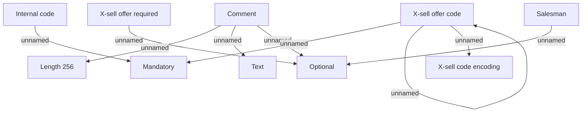

# Other

```mermaid
graph TD
    Length_256["Length 256"]
    X_sell_code_encoding["X-sell code encoding"]
    X_sell_offer_code["X-sell offer code"]
    X_sell_offer_required["X-sell offer required"]
    X_sell_offer_code["X-sell offer code"]
    Mandatory["Mandatory"]
    Salesman["Salesman"]
    Internal_code["Internal code"]
    Comment["Comment"]
    Optional["Optional"]
    Text["Text"]
    Comment -->|unnamed| Length_256
    Comment -->|unnamed| Text
    X_sell_offer_required -->|unnamed| Optional
    Salesman -->|unnamed| Optional
    Comment -->|unnamed| Optional
    X_sell_offer_code -->|unnamed| Mandatory
    Internal_code -->|unnamed| Mandatory
    X_sell_offer_code -->|unnamed| X_sell_offer_code
    X_sell_offer_code -->|unnamed| X_sell_code_encoding
```
