# Payment information

- **Diagram Type**: Custom
- **Package**: HomerSelect/BSL/Analysis Model/Contract Origination/Fill in application/COMMON for Fill in application/Validation Rules/PH/Payment information
- **Diagram ID**: 112074
- **Elements**: 11
- **Connectors**: 10

```mermaid
graph TD
    Card_pick_up_area["Card pick-up area"]
    Card_pickup_salesroom["Card pickup salesroom"]
    Statement_channel["Statement channel"]
    Card_issue_method["Card issue method"]
    Card_Delivery_type["Card Delivery type"]
    DDM_Account_holder_name["DDM Account holder name"]
    Disbursement_method["Disbursement method"]
    Loan_purpose["Loan purpose"]
    Mandatory["Mandatory"]
    Repayment_method["Repayment method"]
    Limit["Limit"]
    Card_issue_method -->|unnamed| Mandatory
    Repayment_method -->|unnamed| Mandatory
    Loan_purpose -->|unnamed| Mandatory
    Disbursement_method -->|unnamed| Mandatory
    DDM_Account_holder_name -->|unnamed| Mandatory
    Limit -->|unnamed| Mandatory
    Card_Delivery_type -->|unnamed| Mandatory
    Statement_channel -->|unnamed| Mandatory
    Card_pickup_salesroom -->|unnamed| Mandatory
    Card_pick_up_area -->|unnamed| Mandatory
```

