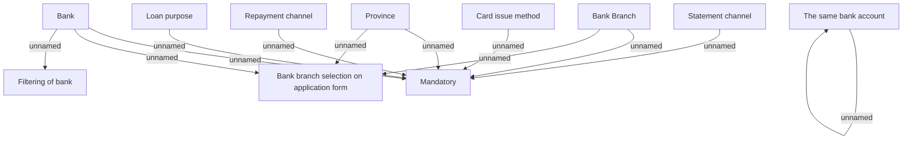

# Payment

```mermaid
graph TD
    Statement_channel["Statement channel"]
    Filtering_of_bank["Filtering of bank"]
    Bank_branch_selection_on_application_form["Bank branch selection on application form"]
    Bank_Branch["Bank Branch"]
    Province["Province"]
    Bank["Bank"]
    Card_issue_method["Card issue method"]
    Repayment_channel["Repayment channel"]
    Mandatory["Mandatory"]
    Loan_purpose["Loan purpose"]
    The_same_bank_account["The same bank account"]
    The_same_bank_account["The same bank account"]
    The_same_bank_account -->|unnamed| The_same_bank_account
    Statement_channel -->|unnamed| Mandatory
    Bank_Branch -->|unnamed| Mandatory
    Province -->|unnamed| Mandatory
    Bank -->|unnamed| Mandatory
    Card_issue_method -->|unnamed| Mandatory
    Repayment_channel -->|unnamed| Mandatory
    Loan_purpose -->|unnamed| Mandatory
    Bank_Branch -->|unnamed| Bank_branch_selection_on_application_form
    Province -->|unnamed| Bank_branch_selection_on_application_form
    Bank -->|unnamed| Bank_branch_selection_on_application_form
    Bank -->|unnamed| Filtering_of_bank
```
