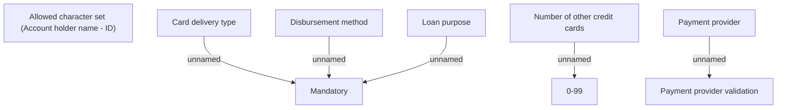

# Payments data validation

- **Diagram Type**: Custom
- **Package**: HomerSelect/BSL/Analysis Model/Contract Origination/Fill in application/COMMON for Fill in application/Validation Rules/ID/Payments
- **Diagram ID**: 111790
- **Elements**: 9
- **Connectors**: 5

