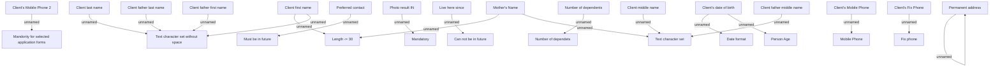

# Personal data

```mermaid
graph TD
    Mandority_for_selected_application_forms["Mandority for selected application forms"]
    Client_s_Mobile_Phone_2["Client's Mobile Phone 2"]
    Text_character_set_without_space["Text character set without space"]
    Length_30["Length ‹= 30"]
    Must_be_in_future["Must be in future"]
    Mandatory["Mandatory"]
    Photo_result_IN["Photo result IN"]
    Live_here_since["Live here since"]
    Can_not_be_in_future["Can not be in future"]
    Date_format["Date format"]
    Preferred_contact["Preferred contact"]
    Number_of_dependets["Number of dependets"]
    Number_of_dependents["Number of dependents"]
    Client_s_date_of_birth["Client's date of birth"]
    Text_character_set["Text character set"]
    Client_father_last_name["Client father last name"]
    Client_father_middle_name["Client father middle name"]
    Client_father_first_name["Client father first name"]
    Client_last_name["Client last name"]
    Client_middle_name["Client middle name"]
    Client_first_name["Client first name"]
    Permanent_address["Permanent address"]
    Permanent_address["Permanent address"]
    Mobile_Phone["Mobile Phone"]
    Client_s_Mobile_Phone["Client's Mobile Phone"]
    Fix_phone["Fix phone"]
    Client_s_Fix_Phone["Client's Fix Phone"]
    Person_Age["Person Age"]
    Mother_s_Name["Mother's Name"]
    Client_last_name -->|unnamed| Text_character_set_without_space
    Photo_result_IN -->|unnamed| Mandatory
    Live_here_since -->|unnamed| Can_not_be_in_future
    Preferred_contact -->|unnamed| Must_be_in_future
    Number_of_dependents -->|unnamed| Number_of_dependets
    Client_s_date_of_birth -->|unnamed| Date_format
    Client_s_date_of_birth -->|unnamed| Person_Age
    Client_father_last_name -->|unnamed| Text_character_set_without_space
    Client_s_Mobile_Phone_2 -->|unnamed| Mandority_for_selected_application_forms
    Client_father_first_name -->|unnamed| Text_character_set_without_space
    Mother_s_Name -->|unnamed| Length_30
    Client_middle_name -->|unnamed| Text_character_set
    Client_first_name -->|unnamed| Length_30
    Client_first_name -->|unnamed| Text_character_set_without_space
    Permanent_address -->|unnamed| Permanent_address
    Client_s_Mobile_Phone -->|unnamed| Mobile_Phone
    Client_s_Fix_Phone -->|unnamed| Fix_phone
    Mother_s_Name -->|unnamed| Text_character_set
    Client_father_middle_name -->|unnamed| Text_character_set
```
