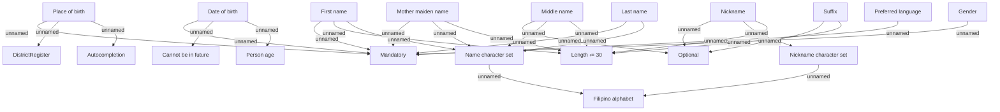

# Personal data

```mermaid
graph TD
    DistrictRegister["DistrictRegister"]
    Autocompletion["Autocompletion"]
    Place_of_birth["Place of birth"]
    Length_30["Length ‹= 30"]
    Person_age["Person age"]
    Gender["Gender"]
    Cannot_be_in_future["Cannot be in future"]
    Nickname_character_set["Nickname character set"]
    Filipino_alphabet["Filipino alphabet"]
    Name_character_set["Name character set"]
    Mandatory["Mandatory"]
    Optional["Optional"]
    Suffix["Suffix"]
    Preferred_language["Preferred language"]
    Nickname["Nickname"]
    Mother_maiden_name["Mother maiden name"]
    Middle_name["Middle name"]
    Last_name["Last name"]
    First_name["First name"]
    Date_of_birth["Date of birth"]
    First_name -->|unnamed| Name_character_set
    Place_of_birth -->|unnamed| Autocompletion
    Mother_maiden_name -->|unnamed| Length_30
    Nickname -->|unnamed| Length_30
    Middle_name -->|unnamed| Length_30
    Suffix -->|unnamed| Length_30
    First_name -->|unnamed| Length_30
    Date_of_birth -->|unnamed| Person_age
    Date_of_birth -->|unnamed| Cannot_be_in_future
    Nickname -->|unnamed| Nickname_character_set
    Nickname_character_set -->|unnamed| Filipino_alphabet
    Place_of_birth -->|unnamed| DistrictRegister
    Mother_maiden_name -->|unnamed| Name_character_set
    Suffix -->|unnamed| Optional
    Last_name -->|unnamed| Name_character_set
    Middle_name -->|unnamed| Name_character_set
    Gender -->|unnamed| Mandatory
    Preferred_language -->|unnamed| Mandatory
    Place_of_birth -->|unnamed| Mandatory
    Mother_maiden_name -->|unnamed| Mandatory
    Last_name -->|unnamed| Mandatory
    First_name -->|unnamed| Mandatory
    Date_of_birth -->|unnamed| Mandatory
    Middle_name -->|unnamed| Optional
    Nickname -->|unnamed| Optional
    Name_character_set -->|unnamed| Filipino_alphabet
```
