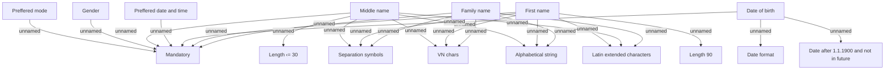

# Personal data

```mermaid
graph TD
    Separation_symbols["Separation symbols"]
    Length_90["Length 90"]
    Latin_extended_characters["Latin extended characters"]
    Alphabetical_string["Alphabetical string"]
    Length_30["Length ‹= 30"]
    VN_chars["VN chars"]
    Date_after_1_1_1900_and_not_in_future["Date after 1.1.1900 and not in future"]
    Preffered_date_and_time["Preffered date and time"]
    Preffered_mode["Preffered mode"]
    Mandatory["Mandatory"]
    Gender["Gender"]
    Date_format["Date format"]
    Middle_name["Middle name"]
    First_name["First name"]
    Family_name["Family name"]
    Date_of_birth["Date of birth"]
    First_name -->|unnamed| Latin_extended_characters
    Preffered_mode -->|unnamed| Mandatory
    Gender -->|unnamed| Mandatory
    Middle_name -->|unnamed| Mandatory
    Middle_name -->|unnamed| Length_30
    Middle_name -->|unnamed| Separation_symbols
    Middle_name -->|unnamed| VN_chars
    Middle_name -->|unnamed| Alphabetical_string
    Middle_name -->|unnamed| Latin_extended_characters
    First_name -->|unnamed| Separation_symbols
    Preffered_date_and_time -->|unnamed| Mandatory
    First_name -->|unnamed| VN_chars
    Date_of_birth -->|unnamed| Mandatory
    First_name -->|unnamed| Alphabetical_string
    First_name -->|unnamed| Mandatory
    Family_name -->|unnamed| Separation_symbols
    Family_name -->|unnamed| VN_chars
    Family_name -->|unnamed| Mandatory
    Family_name -->|unnamed| Alphabetical_string
    Family_name -->|unnamed| Latin_extended_characters
    Date_of_birth -->|unnamed| Date_format
    Date_of_birth -->|unnamed| Date_after_1_1_1900_and_not_in_future
    First_name -->|unnamed| Length_90
```
