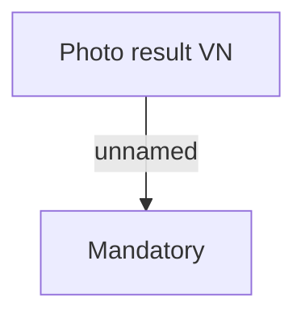

# Photo

- **Diagram Type**: Custom
- **Package**: HomerSelect/BSL/Analysis Model/Contract Origination/Fill in application/COMMON for Fill in application/Validation Rules/VN/Personal information/Photo
- **Diagram ID**: 46677
- **Elements**: 2
- **Connectors**: 1

