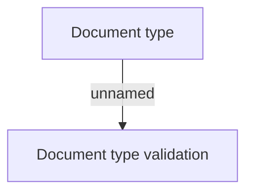

# Primary identification documents

```mermaid
graph TD
    Document_type_validation["Document type validation"]
    Document_type["Document type"]
    Document_type -->|unnamed| Document_type_validation
```
