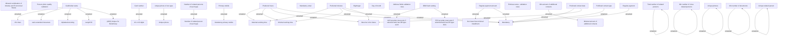

# Product validation

```mermaid
graph TD
    ADD_Unique_for_Beneficiary["{ADD} Unique for Beneficiary
"]
    Allowed_combination_of_Industry_and_Economical_Status["Allowed combination of Industry and Economical Status"]
    Person_photo_quality_validation["Person photo quality validation"]
    VN_chars["VN chars"]
    Latin_extended_characters["Latin extended characters"]
    Alphabetical_string["Alphabetical string"]
    n_16_or_19_digits["16 or 19 digits"]
    Length_50["Length 50"]
    Card_number["Card number"]
    Cardholder_name["Cardholder name"]
    Not_lower_than_minimal_installment["Not lower than minimal installment"]
    Regular_payment_amount["Regular payment amount"]
    Regular_payment["Regular payment"]
    Total_number_of_related_persons["Total number of related persons"]
    Total_number_of_related_persons["Total number of related persons"]
    Maximal_working_time["Maximal working time"]
    Minimal_working_time["Minimal working time"]
    Min_number_of_close_related_persons["Min number of close related persons"]
    Min_number_of_close_related_persons["Min number of close related persons"]
    Mandatory_email["Mandatory email"]
    Unique_phone["Unique phone"]
    Unique_phone_of_one_type["Unique phone of one type"]
    BigInteger["BigInteger"]
    Day_of_month["Day of month "]
    Address_fields_validation_rules["Address fields validation rules"]
    Number_of_related_person_of_each_type["Number of related person of each type"]
    Number_of_related_persons_of_each_type["Number of related persons of each type"]
    Mandatory_primary_mobile["Mandatory primary mobile"]
    Primary_mobile["Primary mobile"]
    Emboss_name_validation_rules["Emboss name - validation rules"]
    ACH_provider_must_exist_if_selected_bank_has_DD_type_ACH["ACH provider must exist if selected bank has DD type ACH"]
    ECS_provider_must_exist_if_selected_bank_has_DD_type_ECS["ECS provider must exist if selected bank has DD type ECS"]
    DDM_bank_setting["DDM bank setting"]
    Minimal_amount_of_additional_contacts["Minimal amount of additional contacts"]
    Min_amount_of_additional_contacts["Min amount of additional contacts"]
    Unique_phones["Unique phones"]
    Unique_phones["Unique phones"]
    Must_be_in_the_future["Must be in the future"]
    Min_number_of_documents["Min number of documents"]
    Mandatory["Mandatory"]
    Preferred_contact_date["Preferred contact date"]
    Preferred_minutes["Preferred minutes"]
    Preferred_hours["Preferred hours"]
    Preffered_contact_type["Preffered contact type"]
    Min_number_of_documents["Min number of documents"]
    Unique_related_person["Unique related person"]
    Unique_related_person["Unique related person"]
    DDM_bank_setting -->|unnamed| ACH_provider_must_exist_if_selected_bank_has_DD_type_ACH
    Cardholder_name -->|unnamed| VN_chars
    Cardholder_name -->|unnamed| Latin_extended_characters
    Cardholder_name -->|unnamed| Alphabetical_string
    Card_number -->|unnamed| n_16_or_19_digits
    Cardholder_name -->|unnamed| Length_50
    Regular_payment_amount -->|unnamed| Not_lower_than_minimal_installment
    Total_number_of_related_persons -->|unnamed| Total_number_of_related_persons
    Preferred_hours -->|unnamed| Maximal_working_time
    Preferred_minutes -->|unnamed| Maximal_working_time
    Preferred_hours -->|unnamed| Minimal_working_time
    Preferred_minutes -->|unnamed| Minimal_working_time
    Min_number_of_close_related_persons -->|unnamed| Min_number_of_close_related_persons
    Unique_phone_of_one_type -->|unnamed| Unique_phone
    Cardholder_name -->|unnamed| ADD_Unique_for_Beneficiary
    Preferred_hours -->|unnamed| Must_be_in_the_future
    Preferred_minutes -->|unnamed| Mandatory
    Preffered_contact_type -->|unnamed| Mandatory
    Preferred_hours -->|unnamed| Mandatory
    Regular_payment -->|unnamed| Mandatory
    Preferred_contact_date -->|unnamed| Mandatory
    Number_of_related_persons_of_each_type -->|unnamed| Number_of_related_person_of_each_type
    Min_number_of_documents -->|unnamed| Min_number_of_documents
    Primary_mobile -->|unnamed| Mandatory_primary_mobile
    Preferred_contact_date -->|unnamed| Must_be_in_the_future
    Preferred_minutes -->|unnamed| Must_be_in_the_future
    Unique_phones -->|unnamed| Unique_phones
    Min_amount_of_additional_contacts -->|unnamed| Minimal_amount_of_additional_contacts
    DDM_bank_setting -->|unnamed| ECS_provider_must_exist_if_selected_bank_has_DD_type_ECS
    Unique_related_person -->|unnamed| Unique_related_person
    Regular_payment_amount -->|unnamed| Mandatory
```
