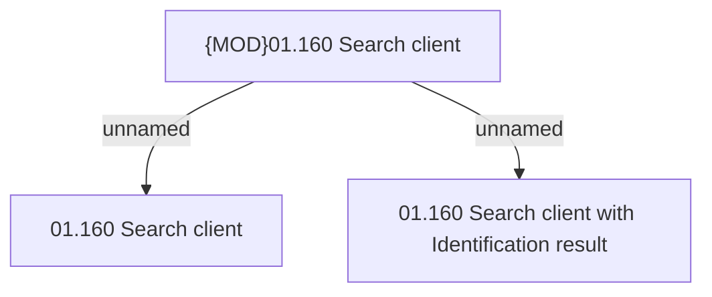

# Access rights

- **Diagram Type**: Custom
- **Package**: HomerSelect/BSL/Analysis Model/Contract Origination/Fill in application/Client search/Access rights
- **Diagram ID**: 122205
- **Elements**: 3
- **Connectors**: 2

