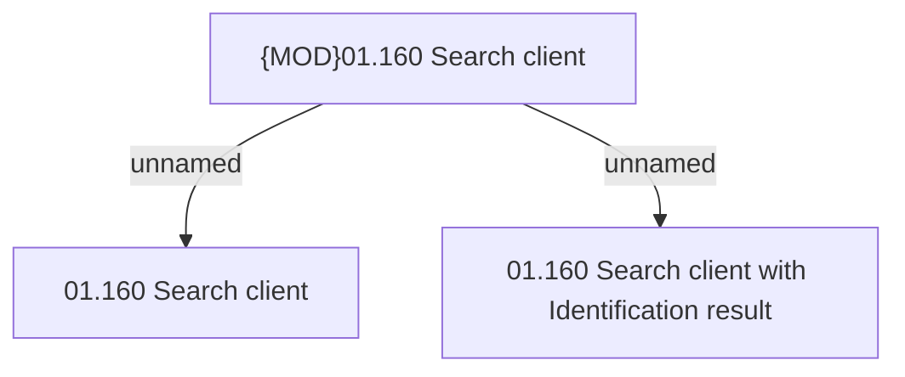

# Access rights

```mermaid
graph TD
    n_01_160_Search_client_with_Identification_result["01.160 Search client with Identification result"]
    MOD_01_160_Search_client["{MOD}01.160 Search client"]
    n_01_160_Search_client["01.160 Search client"]
    MOD_01_160_Search_client -->|unnamed| n_01_160_Search_client
    MOD_01_160_Search_client -->|unnamed| n_01_160_Search_client_with_Identification_result
```
