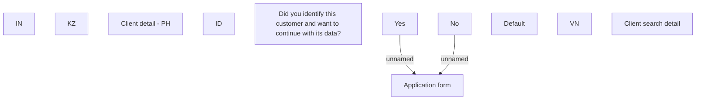

# Client search detail

- **Diagram Type**: Custom
- **Package**: HomerSelect/BSL/Analysis Model/Contract Origination/Fill in application/Client search/User Interface Model/Client detail
- **Diagram ID**: 133241
- **Elements**: 11
- **Connectors**: 2

