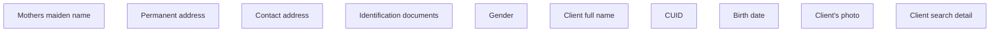

# ID

```mermaid
graph TD
    Mothers_maiden_name["Mothers maiden name"]
    Permanent_address["Permanent address"]
    Contact_address["Contact address"]
    Identification_documents["Identification documents"]
    Gender["Gender"]
    Client_full_name["Client full name"]
    CUID["CUID"]
    Birth_date["Birth date"]
    Client_s_photo["Client's photo"]
    Client_search_detail["Client search detail"]
    Client_s_photo["Client's photo"]
```
