# IN

- **Diagram Type**: Custom
- **Package**: HomerSelect/BSL/Analysis Model/Contract Origination/Fill in application/Client search/User Interface Model/Client detail/IN
- **Diagram ID**: 89097
- **Elements**: 13
- **Connectors**: 0

```mermaid
graph TD
    Permanent_address["Permanent address"]
    Contact_address["Contact address"]
    Phone["Phone"]
    Primary_mobile["Primary mobile"]
    Primary_e_mail["Primary e-mail"]
    Gender["Gender"]
    Preferred_language["Preferred language"]
    Birth_date["Birth date"]
    CUID["CUID"]
    Father_full_name["Father full name"]
    Client_full_name["Client full name"]
    Identification_documents["Identification documents"]
    el_1113690["GUIElement"]
```

