# KZ

- **Diagram Type**: Custom
- **Package**: HomerSelect/BSL/Analysis Model/Contract Origination/Fill in application/Client search/User Interface Model/Client detail/KZ
- **Diagram ID**: 133242
- **Elements**: 11
- **Connectors**: 0

```mermaid
graph TD
    Client_full_name_in_latin["Client full name in latin"]
    Total_overdue_debt["Total overdue debt"]
    National_identification_number["National  identification number"]
    Client_s_photo["Client's photo"]
    Client_s_photo["Client's photo"]
    Identification_documents["Identification documents"]
    Primary_e_mail["Primary e-mail"]
    Gender["Gender"]
    Client_full_name["Client full name"]
    Birth_date["Birth date"]
    Client_search_detail["Client search detail"]
```

