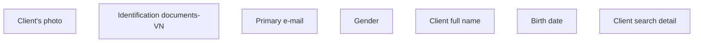

# VN

- **Diagram Type**: Custom
- **Package**: HomerSelect/BSL/Analysis Model/Contract Origination/Fill in application/Client search/User Interface Model/Client detail/VN
- **Diagram ID**: 82188
- **Elements**: 8
- **Connectors**: 0

